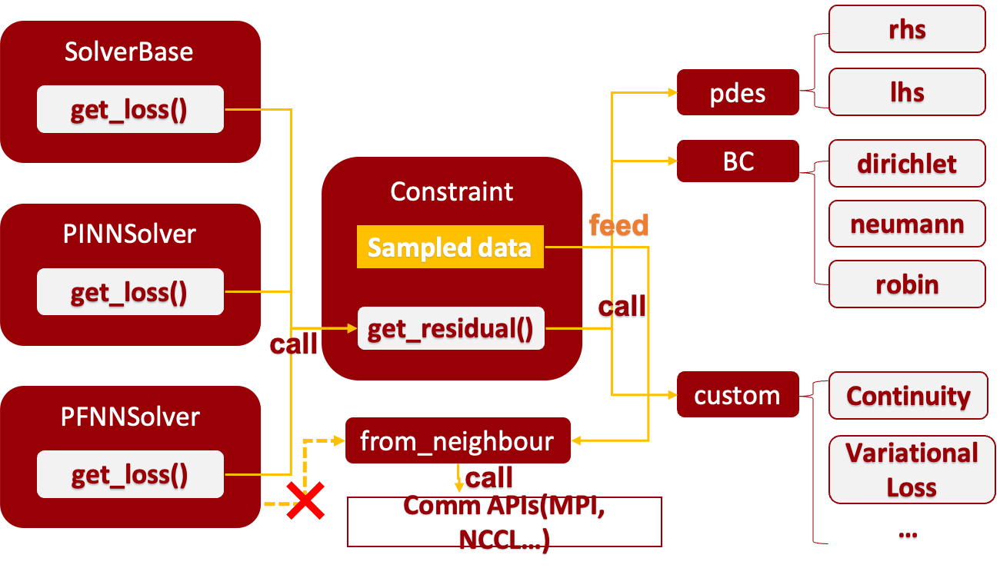

# 数据与采样

本模块负责与数据的获得、存储和使用的部分。在HiNPS中，我们认为：

- 每一个约束都应该以一个`Constraint`对象来表示
- 所有的约束都保存在一个`Dataset`对象中在训练过程中
- `Dataset`对象中会根据需要生成`Sampler`并调用采样逻辑获得数据
- 约束会通过某种**计算**得到一个值作为损失函数的一部分，所以为了进行这个计算`Constraint`对象存储了采样得到的数据，并且定义了这个计算。

## `Constraint` 约束



这一部分内容可以见源代码`data/constraint.py`中。
`Constraint`提供了几种基本的约束形式，这几种基本约束形式我们都假设表示为等式约束，需要给出等式左边和右边的函数句柄，然后该约束分别计算两边的结果然后作差作为残差(residual)。

该对象存储了具体采样得到的数据。
- `x`: (S,N,D)，采样得到的数据，S为子区域数目，如果无区域分解则默认为1；N为采样数目；D为输入数据的维度。
- `x_normal`: 这一项是在输入数据点计算得到的法向单位向量。
- `value`: 是在`x`上通过等式右边函数句柄进行计算得到的函数值。

### 约束表达式

为了表示该约束的计算，主要参数如下：

- `type`:str, 表示该约束的类型，['dirichlet','neumann','internal','from_neighbour','custom']
    - `internal`: 指的是施加在求解区域内部的约束，一般为PDE
    - `from_neighbour`: 指的是在区域分解过程中需要从其他相邻区域获得的边界信息（该类型的约束不需要用户指定）
    - `custom`: 自定义的约束类型，用户需要自己实现计算函数
- `rhs_handle`: expression.Function, 右侧函数的函数句柄
- `lhs_handle`: expression.Function, 左侧函数的函数句柄
    - 若为None，则认为只需要直接用神经网络推理得到pred

具体的计算发生在`get_residual`中。目前我们默认需要由调用者传入一个`network`用来推理。

#### 狄利克雷（第一类）边界条件
在`get_residual`中进行正向推理计算，然后与`value`（等式约束的右侧函数值）作差。

```{note}
`value`是在进行采样的时候就算出来的，所以不需要在此处进行计算。
```
#### 纽曼（第二类）边界条件

需要在构建`Constraint`的时候传入参数：
- `grad_dims`: List, 指的是需要计算梯度的维度序号，例如：
    - `[1,2,3]`指的是在3D含时问题时对空间维度求法向
    - `[0]`指的是对时间维度求“法向”，即对时间求微分。

然后再`get_residual`中我们会计算正向并且求导得到在采样点的梯度在法向上的投影。

$$
\frac{\partial u}{\partial \mathbf{n} } := \nabla_x u(x; \theta) \cdot \mathbf{n_x} 
$$

然后与等式右侧的函数值`value`作差。

#### PDE约束（internal）

PDE的左侧是比较复杂的含微分的表达式。我们需要创建约束`Constraint`时明确给出左侧函数的表达式。见[pde模块](constraint.md)。

它的接口要求是接受`u`作为待解的函数值（神经网络推理的结果），`x`作为采样点，然后计算返回偏微分方程的左侧值。

如果x的维度是[S,N,InputDim]，u的维度应当为[S,N,OutputDim]，等式的右侧函数句柄应当返回一个[S,N,OutputDim]，而该左侧的函数句柄`lhs_handle`应当返回一个[S,N,OutputDim]（与右侧函数句柄范围的数据规模一样）

### 作用范围

表示该约束在时空上的作用范围，我们有以下主要参数：

- `on_boundary`: bool,默认为True. 用于指定当前约束是否是施加在边界上的
- `filter`: expression.Function, 指定当前约束使用的空间范围，
- `time_span`: tuple(2)，指定当前约束使用的时间范围，如果为None则默认为全过程，如果两个值相等则认为是一个时刻（例如初始时刻）


### 自定义你自己的约束
```{note}
撰写中...
```

## `Dataset`数据集

## `Sampler`采样器

目前采样器支持的种类有只有GridSample, UniformSample两种。我们需要给出参数有：

- `inf`,`sup`: 采样范围：我们当前支持在方块区域中采样，只需要给出每个维度的上界(sup)和下界(inf)，例如：
    - `inf=List([0,0,0,0]), sup=List([10,2,2,2])`
- `size`: 采样数据量
- `device`: 采样数据存放的位置, [`cpu`,`cuda:i`,...]

构建完采样器后调用`.sample()`方法可以进行采样。

### 自定义采样逻辑

我们支持自定义重要性采样、自适应采样等采样策略。实现应当保证接口一致性，在`__init__`中初始化该采样方法需要的数据；`.sample()`方法执行采样逻辑。
```{note}
撰写中...
```

```{admonition} Coming up...
   区域分解 
```